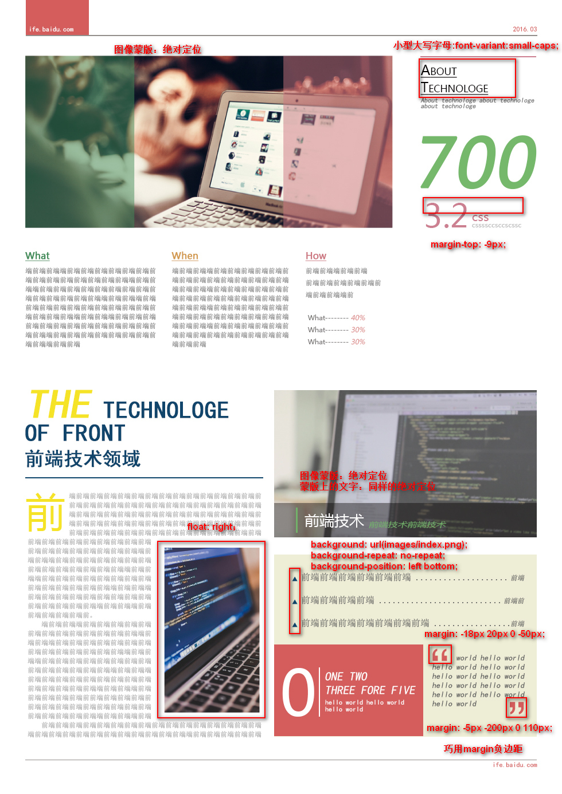

## 任务六：通过HTML及CSS模拟报纸排版
【平均用时 2.1 天】
[【百度地址】](http://ife.baidu.com/course/detail/id/99)
[【我的代码】](https://github.com/baoyuzhang/IFE2017/tree/master/IFE_xiaowei/IFE_xiaowei_task6)  
[【效果预览】](https://baoyuzhang.github.io/IFE2017/IFE_xiaowei/IFE_xiaowei_task6/IFE_xiaowei_task6.html)

### 任务目的
1. 深入掌握CSS中的字体、背景、颜色等属性的设置
2. 进一步练习CSS布局

### 任务描述
- 参考 [PDS设计稿](https://github.com/baoyuzhang/IFE_xiaowei_task6/blob/master/task_1_6_1.psd)，实现页面开发，要求实现效果与[样例](https://github.com/baoyuzhang/IFE_xiaowei_task6/blob/master/task_1_6_2.jpg)基本一致
- 页面中的各字体大小，内外边距等可参看[标注图](https://github.com/baoyuzhang/IFE_xiaowei_task6/blob/master/task_1_6_3.jpg)（标注图有些数据不准确，实际以psd和代码中尺寸为准）
- 页面宽度固定（定宽）

### 任务注意事项
- 只需要完成HTML，CSS代码编写，不需要写JavaScript
- 设计稿中的图片、文案均可自行设定
- 在Chrome中完美实现符合标注中的各项说明
- 有能力的同学可以尝试跨浏览器的兼容性
- 有能力的同学可以在实现一遍后尝试用less, sass或者stylus等再实现一次

### 任务总结

