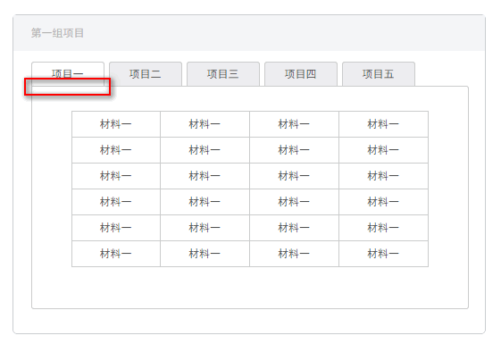
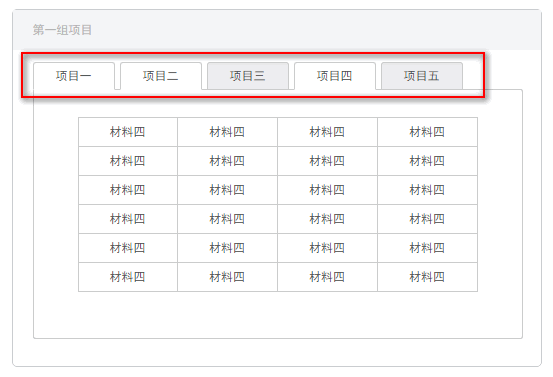
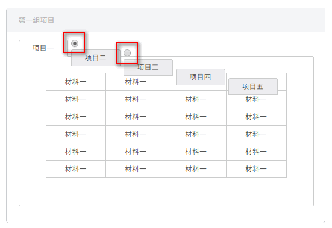
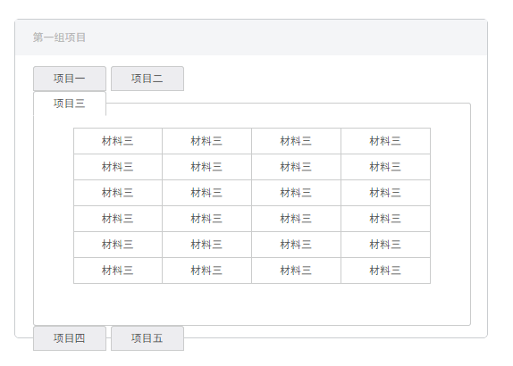
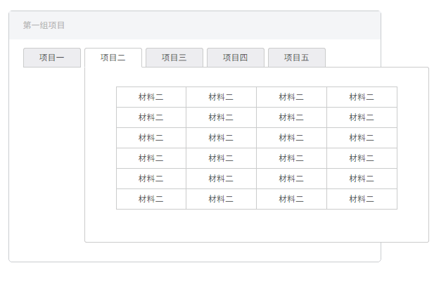

# 任务九：使用HTML/CSS实现一个复杂页面
【平均用时 2.4 天】
[【百度地址】](http://ife.baidu.com/course/detail/id/113)
[【我的代码】](https://github.com/baoyuzhang/IFE2017/tree/master/IFE_xiaowei/IFE_xiaowei_task9)  
[【效果预览】](https://baoyuzhang.github.io/IFE2017/IFE_xiaowei/IFE_xiaowei_task9/IFE_xiaowei_task9.html)

## 任务目的
- 通过实现一个较为复杂的页面，加深对于HTML，CSS的实战能力
- 实践代码的复用、优化

## 任务描述
- 通过HTML及CSS实现设计稿 设计稿PSD文件（点击下载），效果如 效果图（点击打开）
- 整个页面内容宽度固定，但头部的蓝色导航和浏览器宽度保持一致

## 任务注意事项
- 只需要完成HTML，CSS代码编写，不需要写JavaScript
- tab只需要实现样式，有能力余力的同学可以尝试实现不使用JavaScript的情况下，实现Tab切换
所有的下拉菜单（Select）均要求按照设计稿样式实现，下拉后的样式自定义，不需要实现下拉选择的功能，但样式要实现
- 在Chrome中完美实现与设计稿的除了文字以外的各项图片、字体、颜色、布局、内外边距等样式
- 有能力的同学可以尝试跨浏览器的兼容性
- 有能力的同学可以在实现一遍后尝试用less, sass或者stylus等再实现一次

****
## 待解决
- [ ] 日历的完整实现

## 任务总结
1. 重点：纯CSS实现tab切换

  `<input type="radio" name="pro-material" id="pro-1">`：巧用单选按钮，利用CSS3中`:checked`选择器实现切换功能

  `<label for="pro-1">`：for和`<input>`的id相同，显示单选按钮的文字

  `<div class="pro-table-1">`：没有checked时`display: none;`,checked时`display: block;`

  ```
  <li>
	    <input type="radio" name="pro-material" id="pro-1" checked>
	    <label for="pro-1">项目一</label>
	    <div class="pro-table-1">
	    	<table>...</table>
	    </div>
 </li>
```

2. 边框重叠部分不显示的效果实现方法：
  - 小div的底边框设为none
  - 小div显示在大div上面：小div`position: relative;`，大div`position: absolute;`

  

**注意！**

1. `<input>`一定要有相同的name属性，否则不属于一个单选按钮，将出现以下错误：


2. `<input>`一定要有`appearance: none;`或`display:none`的CSS样式，否则将出现以下错误：


  若使用`appearance: none;`要注意浏览器的兼容性：

  ```
  appearance: none;
  -moz-appearance: none;
  -webkit-appearance: none;
  ```

3. `<li>`和`<label>`都要`float:left;`

  若`<li>`和`<label>`都没有`float:left;`，将出现以下错误：

  

  若`<li>`没有`float:left;`，将出现以下错误：

  

  若`<label>`没有`float:left;`，将出现以下错误：

  

4. `<div class="pro-table-1">`要使用绝对定位，否则，将出现以下错误：


  
